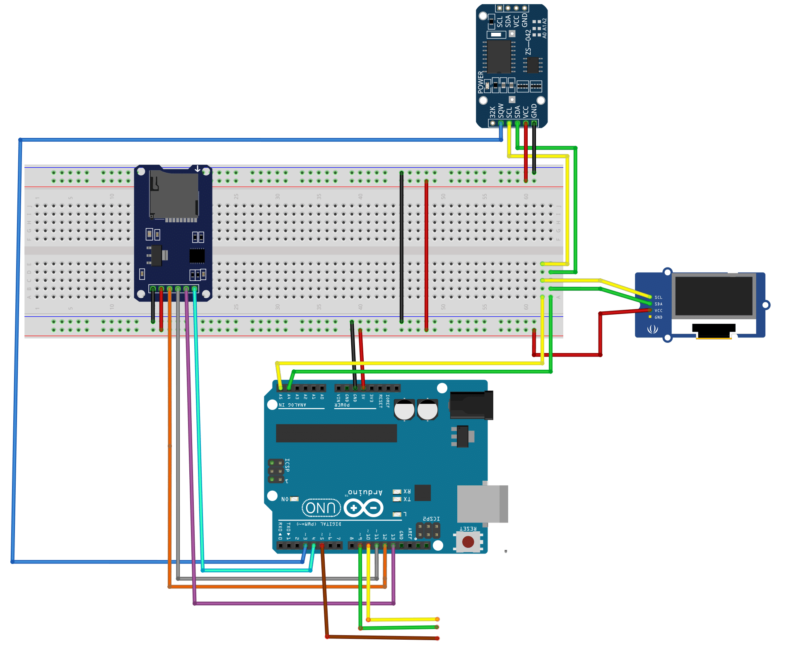
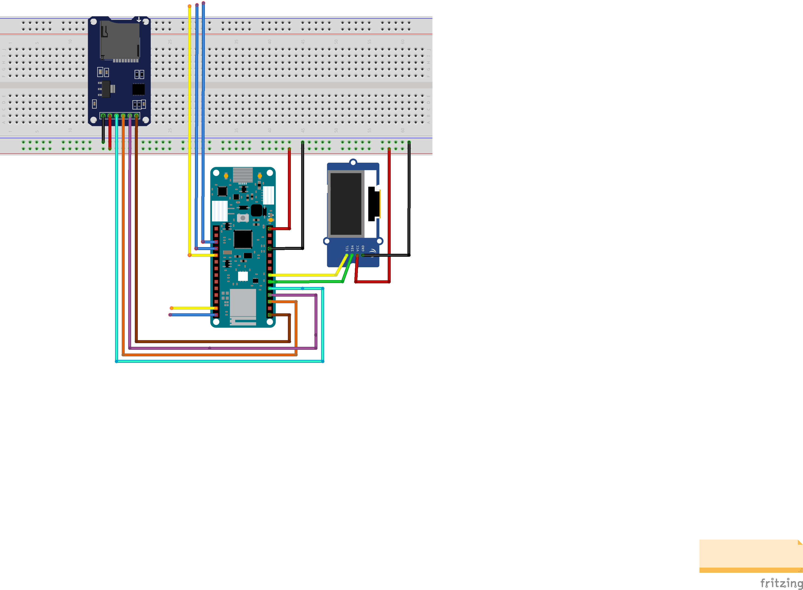

# Battery Managment System 
Battery Managment System running on Arduino Uno or Arduino MKR WIFI 1010.

## Table of contents
* [General info](#general-info)
* [Technologies](#technologies)
* [Hardware Arduino Uno](#hardware)
* [Dependencies Arduino Uno](#dependencies)
* [Setup Arduino Uno](#setup)
* [Hardware Arduino MKR WIFI 1010](#hardware2)
* [Dependencies Arduino MKR WIFI 1010](#dependencies2)

## General info 
Battery Managment System with RTC, SDcard and OLED-display for Arduino Uno and RTC, AWS cloud and OLED-display for Arduino MKR WIFI 1010. IDE Visual Studio Code and platfomio to setup environment.

## Technologies
* Arduino programming language 
* C/C++
* Visual Studio Code
* Platformio 

## Hardware Arduino Uno
* Real-Time Clock Module (DS3231)
* MicroSD Card Adapter 
* 3x1.3-inch, 128x64 pixel OLED-display

## Dependencies Arduino Uno
* Arduino Time Library by Paul Stoffregen: https://github.com/PaulStoffregen/Time
* Arduino DS3232RTC Library by Jack Christensen: https://github.com/JChristensen/DS3232RTC
* Arduino Library U8g2 by olikraus: https://github.com/olikraus/u8g2
* Ardiuno Standard Library: SD.h, SPI.h

## Setup Arduino Uno

## Hardware Arduino MKR WIFI 1010
* MicroSD Card Adapter 
* 3x1.3-inch, 128x64 pixel OLED-display

## Dependencies Arduino Uno
* Arduino Library U8g2 by olikraus: https://github.com/olikraus/u8g2
* Ardiuno Standard Library: SD.h, SPI.h, RTCZero

## Setup Arduino MKR WIFI 1010

